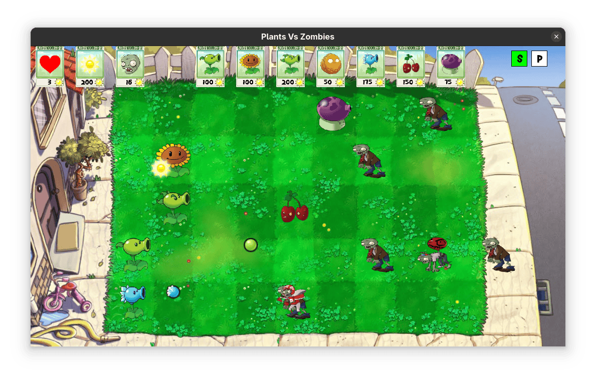

# Plants VS Zombies C++



## Description
This is a simplified implementation of the popular game Plants VS Zombies. The game is implemented in C++ and uses the SFML library for graphics. The game is a tower defense game where the player has to defend their house from zombies by planting plants that attack the zombies.

## Demo Video
Check out the gameplay video on YouTube:
[Plants VS Zombies Game Demo](https://youtu.be/8vr5m9_TbbI)

## Installation
To compile and run the game on linux, you need to have the C++ compiler and the SFML library installed on your system. You can install the SFML library by running the following command:

```bash
sudo apt-get install build-essential  # Install the C++ compiler
sudo apt-get install libsfml-dev      # Install the SFML library
```

## Usage
To compile and run the game, you can use the following commands:

```bash
make compile  # Compile the game
make run      # Run the game
```
